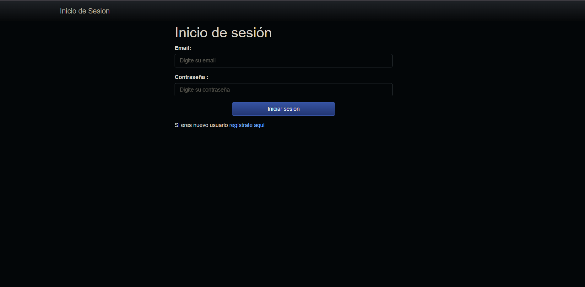
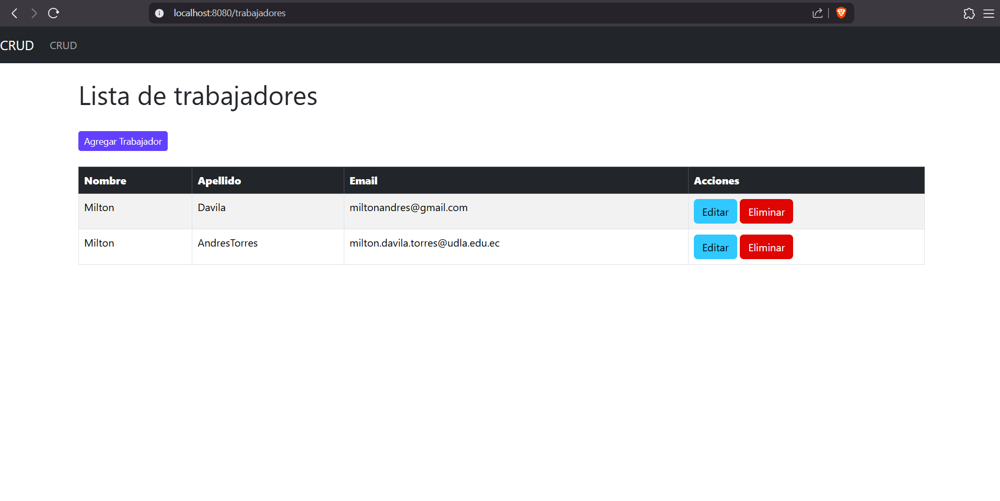
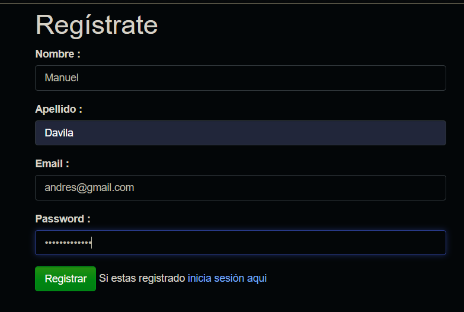
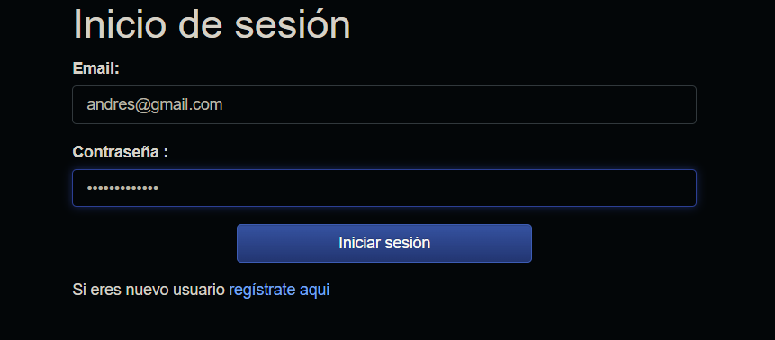
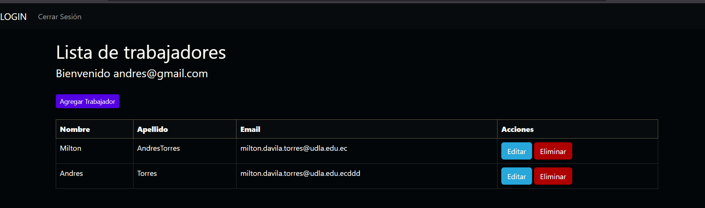
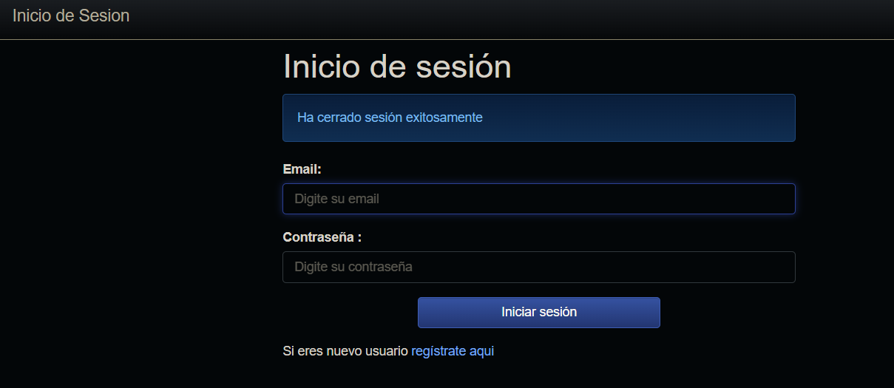

# CRUD
Bienvenidos, este es mi sistema de Login hecho en Spring, utilizando las librerias de JPA, Thymeleaf, MySQL y Spring Security. En el siguiente documento veremos como funciona y como se compone este proyecto.

# Descripcion
Dentro del proyecto el login se hizo a través de Spring Security, utiliza las librerias Spring por defecto en Maven y varias librerias,como Thymeleaf, para generar las vistas, JPA y Spring web tools y el Spring Security para hacer que exista una autenticación de usuario antes de poder navegar por cualquier vista, la creación de roles para las vistas, un codificador de contraseñas y el SecurityConfiguration para que en el logout invalide la sesión Http y limpie la autenticación. Si el usuario no puede hacer un login, tendrá que crear una cuenta con su email y contraseña a traves de un registro en el login. Funciona correctamente el login, al iniciar sesión ira al a ver los trabajadores con su CRUD. Esto estuvo algo complicado ya que al implementar un proyecto con la nueva libreria de Spring Security, ya incorpora el Login de inicio, haciendo que se tengan que mover las vistas por completo y llamar el codificador de contraseñas a la base de datos para esto. De ahí el login funciona correctamente.

# Como instalar:
1. Tenemos que tener instalado el MySQL, JDK 21 de java y un IDE de java.
2. Descargamos el codigo dentro del github
3. Tenemos que ir a nuestro IDE y abrir dicho codigo.
4. Tenemos que crear en nuestra base de datos MySQL, una nueva base de datos completamente nueva.
5. Vamos a nuestro codigo y vamos a la carpeta resources/application.properties
6. Cambiamos en spring.datasource.url=jdbc:mysql://localhost:(Nuestro puerto)/(Nuestro nombre de base de datos que hemos creado)
7. Si tenemos para ingresar un usuario y una clave propia cambiamos entonces 
    spring.datasource.username=root --> tu username
    spring.datasource.password=holamundo --> Tu clave de root o de username
8. Vamos a java/CrudApplication y damos a correr
9. Si estamos corriendo algo mas en el puerto 8080, entonces tendremos que cambiarlo en el resources/application.properties para otro puerto.
10. Vamos a cualquier navegador y escribimos http://localhost:8080
11. Listo, tendria que salir algo asi

# Como funciona:
1. Al ingresar tendremos un inicio de sesión, en este caso al no tener un usuario o en este caso mail asociado, tendremos que crear uno

2. Aqui tendremos que crear nuestro usuario y contraseña.

Al finalizar ponemos registrar y nos debe aparecer un mensaje diciendonos que se ha registrado correctamente

3. Ingresamos al login y ponemos los datos y aplastamos en Iniciar sesión

4. Al hacer esto iniciaremos sesion y entraremos en la pagina del CRUD de trabajadores!

5. Podemos hacer todo lo que nuestro CRUD hacia y podemos en la parte superior cerrar sesión.

6. Al hacer esto volveremos al login y dirá que cerramos la sesión con exito. Eso es todo!

