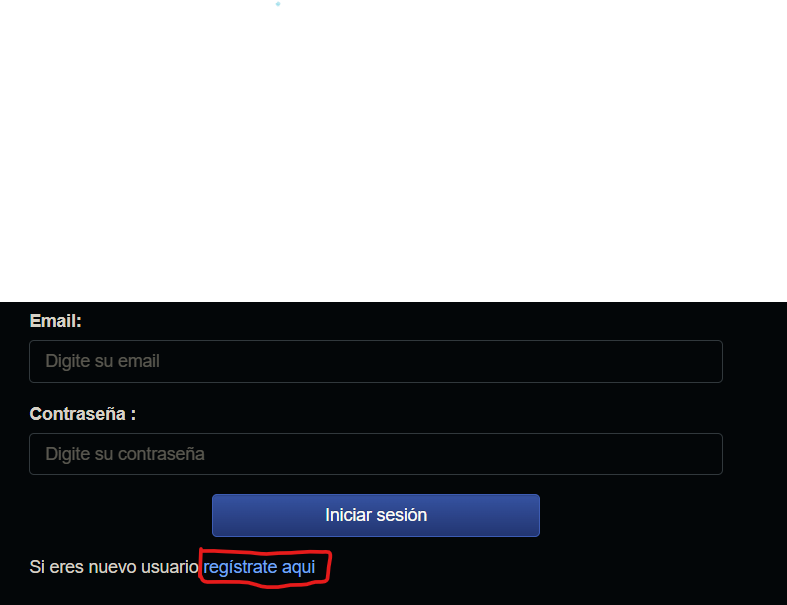

# CRUD
Bienvenidos, este es mi sistema de de CRUD hecho en Spring, utilizando las librerias de JPA, Thymeleaf, MySQL. En el siguiente documento veremos como funciona y como se compone este proyecto.

# Descripcion
Dentro del proyecto se utilizo una forma sencilla de utilizar el MVC, en este caso cuando iniciamos diciendo que utiliza Spring y varias librerias, en primer lugar la libreria de Thymeleaf, para generar las vistas, JPA y Spring web tools. Funciona correctamente su READ, al iniciar ira al a ver los usuarios, tambien funciona su create y el editar y el eliminar. Realmente no fue complicada, espero con esto avanzar en mi crecimiento a la hora de crear paginas web.

# Como instalar:
1. Tenemos que tener instalado el MySQL, JDK 21 de java y un IDE de java.
2. Descargamos el codigo dentro del github
3. Tenemos que ir a nuestro IDE y abrir dicho codigo.
4. Tenemos que crear en nuestra base de datos MySQL, una nueva base de datos completamente nueva.
5. Vamos a nuestro codigo y vamos a la carpeta resources/application.properties
6. Cambiamos en spring.datasource.url=jdbc:mysql://localhost:(Nuestro puerto)/(Nuestro nombre de base de datos que hemos creado)
7. Si tenemos para ingresar un usuario y una clave propia cambiamos entonces 
    spring.datasource.username=root
    spring.datasource.password=holamundo
8. Vamos a java/CrudApplication y damos a correr
9. Si estamos corriendo algo mas en el puerto 8080, entonces tendremos que cambiarlo en el resources/application.properties para otro puerto.
10. Vamos a cualquier navegador y escribimos http://localhost:8080
11. Listo, tendria que salir algo asi

# Como funciona:
1. Al ingresar tendremos el READ de la base datos.
2. Podremos ingresar un trabajador.
3. Al terminar el ingreso podremos editar o eliminar al empleado
4. Eso seria todo!

